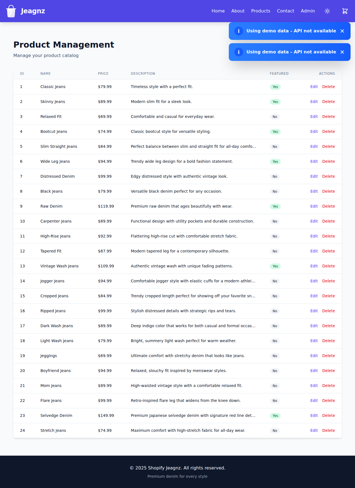
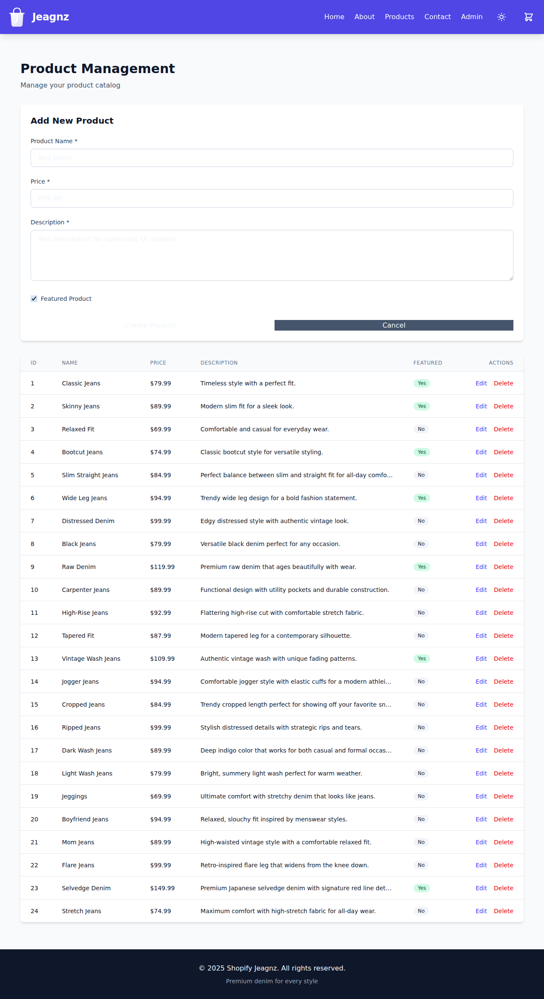
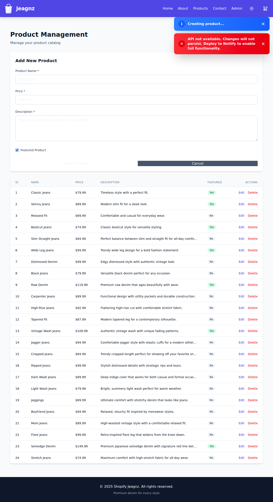
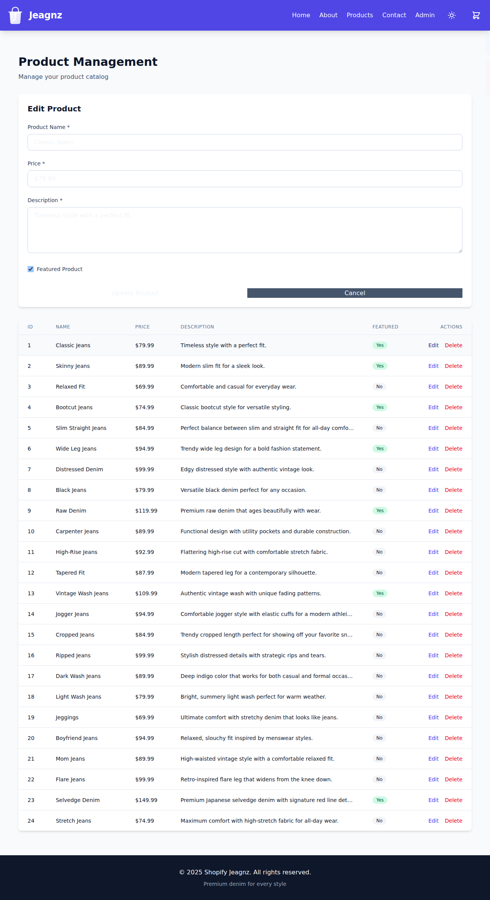
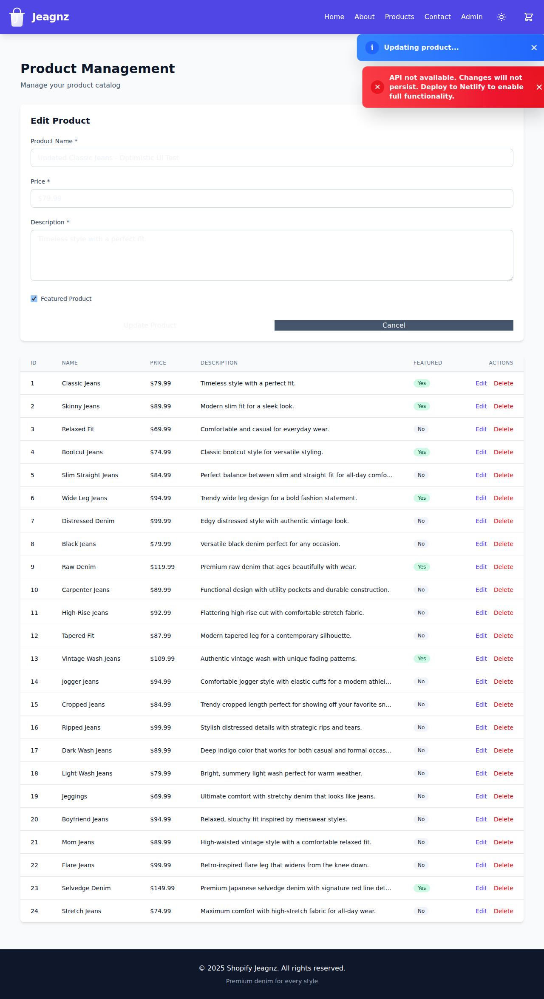
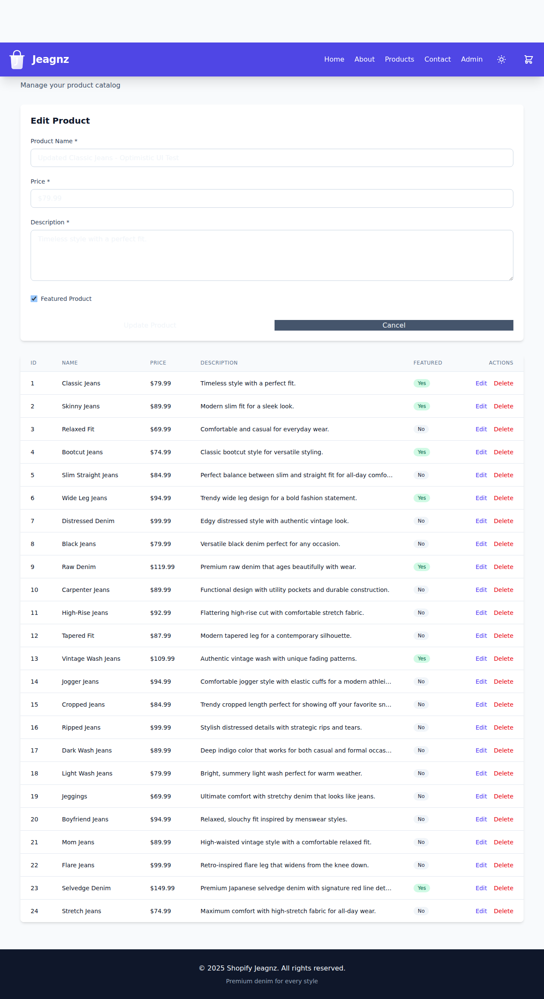

# Optimistic UI Updates - Admin CRUD

## Overview

The Admin CRUD interface now implements **optimistic UI updates** to provide instant feedback and improve user experience when working with serverless backend functions that may experience cold start latency.

## What are Optimistic Updates?

Optimistic updates mean the UI is updated immediately when a user performs an action (create, update, delete), without waiting for the server response. If the server request fails, the changes are automatically rolled back to the previous state.

## Implementation Details

### Key Features

1. **Immediate UI Updates**: Changes appear instantly in the UI
2. **Visual Feedback**: Loading spinners and pulsing animations indicate pending operations
3. **Automatic Rollback**: Failed operations restore the previous state
4. **Toast Notifications**: Users are informed about operation status (in-progress, success, error)
5. **Disabled Actions**: Buttons are disabled during optimistic updates to prevent conflicts

### How It Works

#### Create Product
1. User submits the product form
2. Product is immediately added to the table with a temporary ID
3. Toast shows "Creating product..."
4. API request is sent in the background
5. On success: Product list refreshes with real data from server
6. On failure: New product is removed, error toast is shown

#### Update Product
1. User edits and submits product changes
2. Product row is immediately updated in the table
3. Row gets blue highlight background and pulsing animation
4. Loading spinner appears next to the product ID
5. Edit/Delete buttons are disabled for that row
6. Toast shows "Updating product..."
7. On success: Product list refreshes, animations stop
8. On failure: Original product data is restored, error toast is shown

#### Delete Product
1. User confirms deletion
2. Product is immediately removed from the table
3. Toast shows "Deleting product..."
4. API request is sent in the background
5. On success: Product list refreshes to confirm deletion
6. On failure: Product is restored to the table, error toast is shown

### Code Implementation

The optimistic updates are implemented in `src/pages/Admin.tsx`:

- **State Management**: `optimisticUpdates` Set tracks products being updated
- **Visual Indicators**: Conditional classes for animations and spinner display
- **Rollback Logic**: Previous state is captured before updates and restored on errors
- **Action Disabling**: Buttons disabled when `isOptimistic` is true

```tsx
// Track optimistic updates
const [optimisticUpdates, setOptimisticUpdates] = useState<Set<number>>(new Set());

// Visual feedback in table row
const isOptimistic = optimisticUpdates.has(product.id);
className={`... ${isOptimistic ? 'bg-blue-50 dark:bg-blue-900/20 animate-pulse' : ''}`}

// Rollback on error
catch (err) {
  setProducts(previousProducts); // Restore previous state
  showToast(API_UNAVAILABLE_MESSAGE, 'error');
}
```

## Benefits

### For Users
- **Instant Feedback**: No waiting for slow serverless cold starts
- **Better UX**: Feels responsive and fast
- **Clear Status**: Visual indicators show what's happening
- **Error Recovery**: Failed operations gracefully roll back

### For Developers
- **Serverless-Friendly**: Handles cold start latency elegantly
- **Consistent State**: Automatic rollback prevents inconsistencies
- **Easy to Maintain**: Centralized state management

## Screenshots

### Initial Admin View


The admin page showing the product management table with all products.

### Add Product Form


The form for creating a new product with validation.

### Filled Form


Product form filled with data, ready to submit.

### Optimistic Create


Toast notifications showing "Creating product..." and API unavailability message (expected in dev mode).

### Edit Product Form


Editing an existing product with pre-filled form data.

### Optimistic Update with Spinner


Table row showing loading spinner and visual feedback during an update operation. The row has a blue highlight and pulsing animation.

### Final State


Products table after successful operations, showing updated data.

## Technical Notes

### Serverless Compatibility
- Works perfectly with Netlify Functions
- Handles cold start delays (3-10 seconds)
- Provides instant feedback regardless of backend latency

### Error Handling
- All API errors trigger automatic rollback
- User-friendly error messages
- Console logging for debugging

### Performance
- Minimal re-renders using Set for tracking updates
- Conditional rendering for visual indicators
- Efficient state updates with immutable patterns

## Testing

To test optimistic updates locally:

1. Start the dev server: `npm run dev`
2. Navigate to `/admin`
3. Create, update, or delete a product
4. Notice instant UI updates
5. Check console for API responses
6. Verify rollback on simulated errors

## Future Enhancements

Potential improvements for the future:

- [ ] Queue multiple operations
- [ ] Retry failed operations automatically
- [ ] Offline support with local storage
- [ ] Conflict resolution for concurrent edits
- [ ] Undo/redo functionality
- [ ] Batch operations with optimistic updates

## Related Files

- `src/pages/Admin.tsx` - Main implementation
- `src/components/ProductForm.tsx` - Form component
- `src/services/api.ts` - API service layer
- `netlify/functions/api.ts` - Serverless backend

## References

- [Optimistic UI Patterns](https://www.apollographql.com/docs/react/performance/optimistic-ui/)
- [React State Management Best Practices](https://react.dev/learn/managing-state)
- [Netlify Functions](https://docs.netlify.com/functions/overview/)
