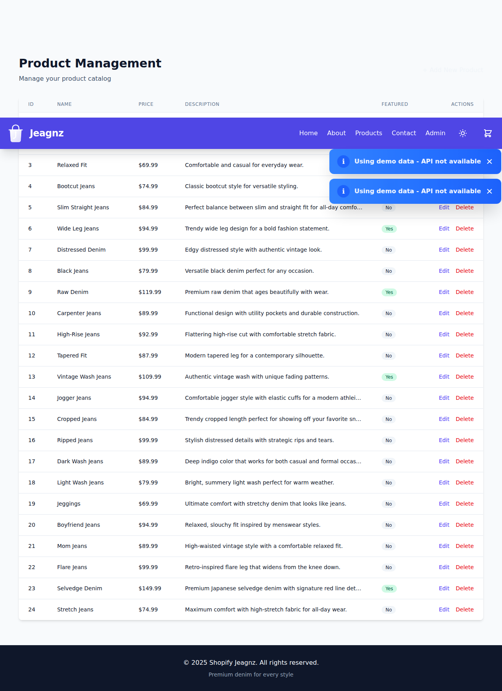

# 🛍️ Bienvenido a Shopify Jeagnz

   

**Shopify Jeagnz** es una aplicación moderna de comercio electrónico especializada en jeans premium, construida con las últimas tecnologías web. La aplicación ofrece una experiencia de compra fluida, diseño responsive mobile-first, y una interfaz administrativa completa para gestión de productos.

---

## 🌐 Aplicación en Vivo

**URL de la aplicación desplegada:** [https://shopify-jeagnz.netlify.app/](https://shopify-jeagnz.netlify.app/)


*Página de inicio de Shopify Jeagnz con hero section y productos destacados*

---

## ✨ Características Principales

### 🎨 **Diseño Moderno y Responsive**
- Diseño mobile-first optimizado para todos los dispositivos
- Interfaz limpia y profesional con Tailwind CSS 4
- Tema oscuro/claro con persistencia en localStorage
- Animaciones suaves y transiciones elegantes

### 🛒 **Funcionalidad E-commerce Completa**
- Catálogo de productos con búsqueda y filtrado
- Carrito de compras persistente
- Proceso de checkout simplificado
- Vista detallada de productos con información completa

### ⚡ **Rendimiento Optimizado**
- Construcción con Vite para desarrollo rápido
- Funciones serverless en Netlify
- Caché inteligente con localStorage
- Manejo de cold-start para APIs serverless

### 👨‍💼 **Panel de Administración**
- CRUD completo de productos
- Actualizaciones optimistas de UI
- Validación de formularios en tiempo real
- Gestión de productos destacados

### 🔒 **Calidad y Seguridad**
- TypeScript para type-safety completo
- ESLint para calidad de código
- Manejo robusto de errores
- Validación de datos en cliente y servidor

---

## 📚 Navegación del Wiki

Explora la documentación completa navegando por las siguientes secciones:

| Sección | Descripción |
|---------|-------------|
| **[📦 Instalación](Installation.md)** | Guía completa para configurar el proyecto localmente |
| **[📱 Productos](Products.md)** | Documentación del catálogo y detalles de productos |
| **[🛒 Carrito](Cart.md)** | Funcionalidad del carrito de compras |
| **[💳 Checkout](Checkout.md)** | Proceso de compra y confirmación de pedidos |
| **[🏗️ Arquitectura](Architecture.md)** | Detalles técnicos, estructura del código y patrones |
| **[🤝 Contribuir](Contributing.md)** | Guía para contribuidores y proceso de pull requests |

---

## 🚀 Stack Tecnológico

### Frontend
- **React 19** - Biblioteca JavaScript para interfaces de usuario
- **TypeScript** - JavaScript con tipado estático
- **Vite** - Herramienta de construcción de siguiente generación
- **Tailwind CSS 4** - Framework CSS utility-first
- **React Router 7** - Enrutamiento del lado del cliente

### Backend
- **Netlify Functions** - Funciones serverless para API
- **Express** - Framework web minimalista para Node.js (opcional)
- **MongoDB** - Base de datos NoSQL (opcional)

### Herramientas de Desarrollo
- **ESLint** - Linter para calidad de código
- **PostCSS** - Procesamiento de CSS
- **Playwright** - Testing end-to-end

---

## 🎯 Casos de Uso

### Para Usuarios Finales
- Navegar y buscar productos de jeans premium
- Ver detalles completos de productos con imágenes y descripciones
- Agregar productos al carrito y gestionar cantidades
- Completar compras de forma rápida y sencilla

### Para Administradores
- Gestionar catálogo de productos (crear, editar, eliminar)
- Marcar productos como destacados
- Validar precios y descripciones
- Ver actualizaciones en tiempo real

### Para Desarrolladores
- Aprender patrones modernos de React
- Implementar actualizaciones optimistas de UI
- Trabajar con funciones serverless
- Contribuir al proyecto de código abierto

---

## 📸 Capturas de Pantalla

### Página de Inicio

*Hero section con productos destacados y navegación intuitiva*

### Catálogo de Productos

*Grid responsive con búsqueda y filtros*

### Panel de Administración

*Interface de gestión completa con tabla de productos*

---

## 🌟 ¿Por Qué Shopify Jeagnz?

1. **Código Moderno**: Utiliza las últimas versiones de React, TypeScript y Tailwind CSS
2. **Best Practices**: Implementa patrones de diseño y arquitectura probados
3. **Documentación Completa**: Wiki exhaustiva para usuarios y desarrolladores
4. **Open Source**: Proyecto de código abierto listo para contribuciones
5. **Producción Ready**: Desplegado en Netlify con CI/CD configurado

---

## 🚀 Inicio Rápido

```bash
# Clonar el repositorio
git clone https://github.com/jeremyagnz/Shopify-Jeagnz.git

# Instalar dependencias
cd Shopify-Jeagnz
npm install

# Iniciar servidor de desarrollo
npm run dev

# Abrir en el navegador
# http://localhost:5173
```

Para instrucciones detalladas, visita la sección **[📦 Instalación](Installation.md)**.

---

## 🤝 Contribuir

¡Las contribuciones son bienvenidas! Por favor lee nuestra **[Guía de Contribución](Contributing.md)** para conocer el proceso de pull requests y estándares de código.

---

## 📞 Soporte

Si tienes preguntas o necesitas ayuda:
- 📖 Consulta esta documentación
- 🐛 Reporta bugs en [GitHub Issues](https://github.com/jeremyagnz/Shopify-Jeagnz/issues)
- 💬 Contacta al equipo a través de la página de contacto

---

## 📄 Licencia

Este proyecto está disponible como código abierto. Ver el archivo LICENSE en el repositorio para más detalles.

---

*Última actualización: Diciembre 2024*